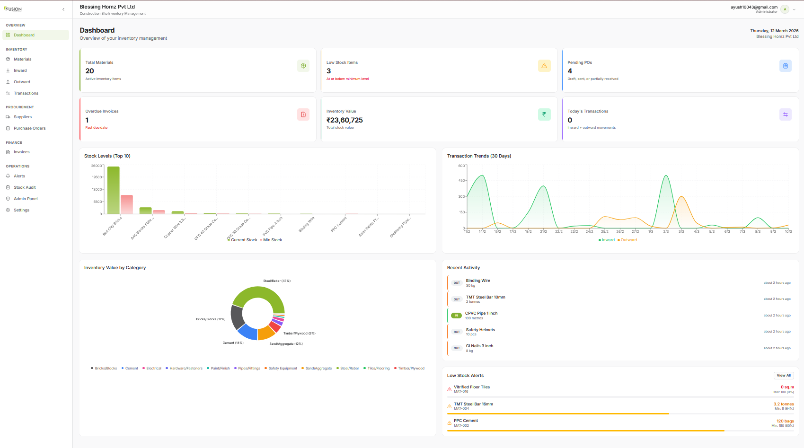
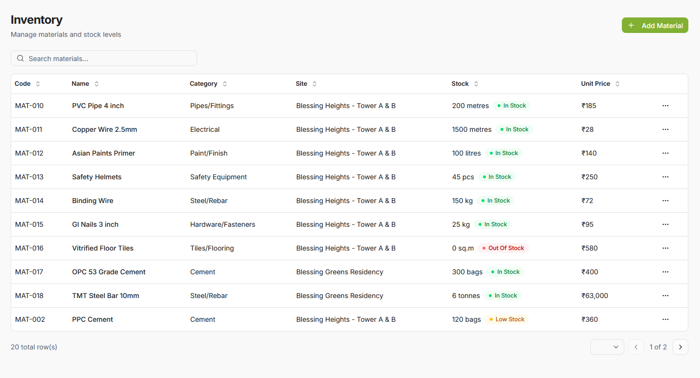
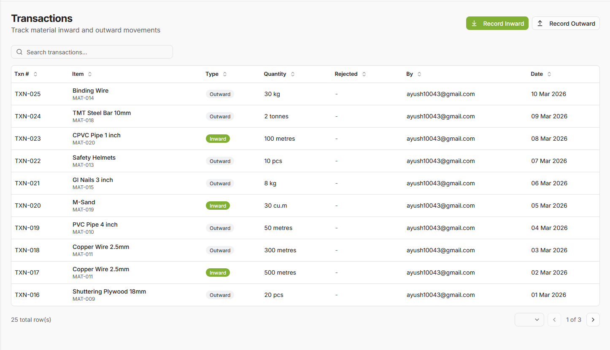
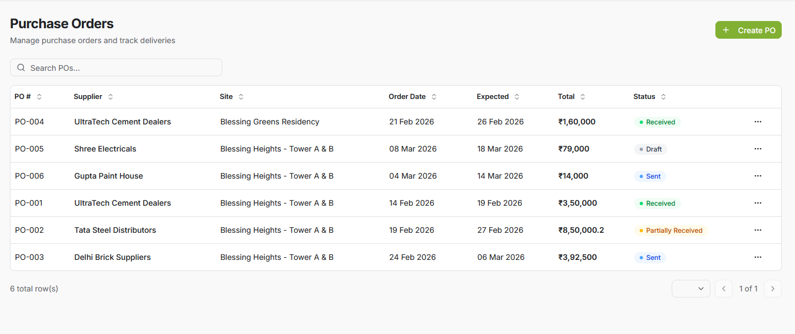
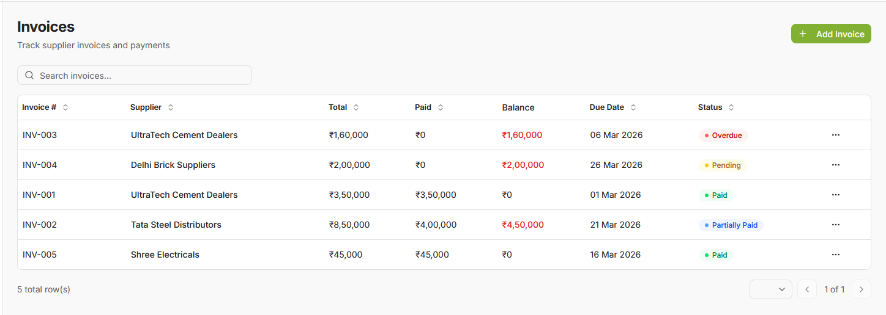
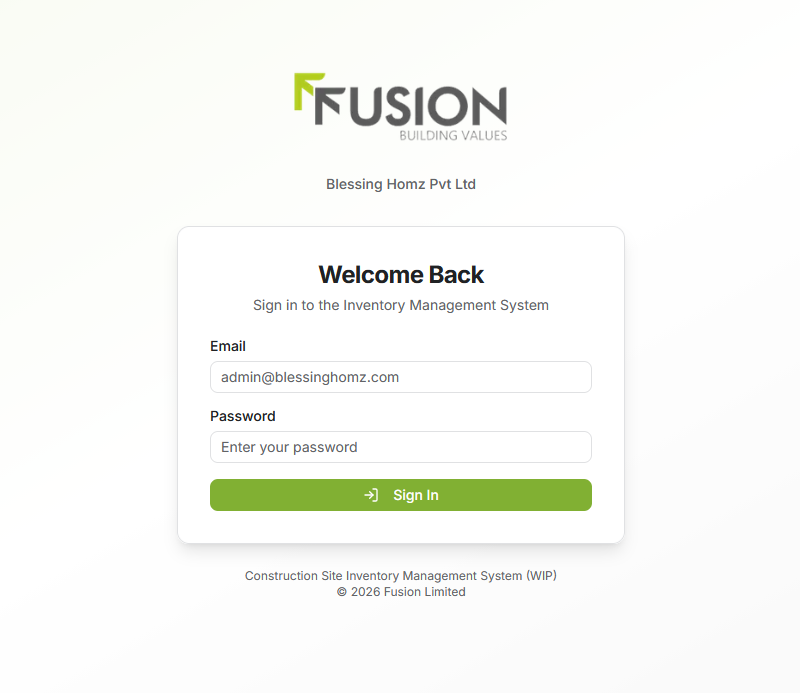
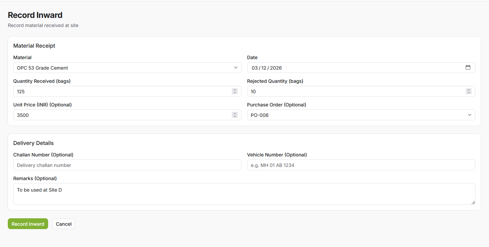
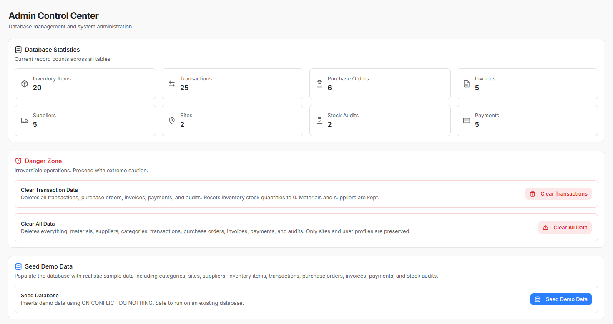

<div align="center">


# CSIMS

**Construction Site Inventory Management System**

A full-stack inventory management platform built for construction operations.
Track materials, manage suppliers, process purchase orders, handle invoices, and audit stock — all from one dashboard.

Built for [Blessing Homz Pvt Ltd](https://fusionlimited.in), a subsidiary of Fusion Limited.

[](https://nextjs.org/)
[](https://react.dev/)
[](https://typescriptlang.org/)
[](https://tailwindcss.com/)
[](https://supabase.com/)
[](#)

</div>

---

## Preview

<div align="center">



*Dashboard — KPI cards, stock level charts, transaction trends, category breakdown, recent activity, and low stock alerts*

</div>

<br />

<div align="center">

| Inventory | Transactions |
|:-:|:-:|
|  |  |
| *Material master with stock status indicators* | *Inward & outward movements with color-coded types* |

| Purchase Orders | Invoices |
|:-:|:-:|
|  |  |
| *Full PO lifecycle — Draft, Sent, Partially Received, Received* | *Invoice tracking with overdue detection and payment status* |

</div>

<details>
<summary><strong>More screenshots</strong></summary>
<br />

<div align="center">

| Login | Record Inward | Admin Panel |
|:-:|:-:|:-:|
|  |  |  |
| *Branded login with Fusion identity* | *Material receipt form with delivery details* | *Database stats, danger zone, and seed controls* |

</div>

</details>

---

## Overview

Construction sites deal with hundreds of materials flowing in and out daily. Manual tracking with spreadsheets leads to inaccurate stock records, delayed procurement, untracked material movements, and poor financial visibility.

CSIMS replaces that with a centralized digital platform:

- **Real-time stock levels** across multiple construction sites
- **Automated workflows** — stock updates on transactions, PO status transitions on receipt, invoice status changes on payment
- **Role-based access** so admins, site managers, and store keepers each see what they need
- **Audit trail** on every material movement, with variance detection for physical-vs-system reconciliation

The system covers the full procurement-to-consumption cycle: from creating a purchase order, to receiving materials, recording supplier invoices, tracking payments, and auditing what's actually on site.

---

## Key Features

| Area | Capabilities |
|------|-------------|
| **Dashboard** | KPI cards, stock level charts, transaction trends, category distribution, recent activity feed, low stock alerts |
| **Inventory** | Material master with categories, sites, storage locations, stock tracking, pricing, search and filtering |
| **Transactions** | Record inward (receipt) and outward (issue) movements with full audit trail; stock auto-updates via triggers |
| **Suppliers** | Vendor directory with contact details, tax info, addresses, and bank information |
| **Purchase Orders** | Create POs with line items; lifecycle tracking: Draft &rarr; Sent &rarr; Partially Received &rarr; Received |
| **Invoices & Payments** | Record supplier invoices, log partial/full payments, auto-detect overdue invoices |
| **Stock Audits** | Physical stock verification with live variance calculation and review workflow |
| **Alerts** | Low stock warnings, out-of-stock flags, and automated reorder suggestions |
| **Access Control** | Role-based permissions with Row Level Security on every table |
| **Responsive UI** | Works on desktop and mobile with collapsible navigation |

---

## Modules

| Module | Route | Description |
|--------|-------|-------------|
| Dashboard | `/dashboard` | Overview with KPIs, charts, and recent activity |
| Inventory | `/inventory` | Material CRUD with detail views |
| Transactions | `/transactions` | Inward and outward stock movements |
| Suppliers | `/suppliers` | Supplier directory and management |
| Purchase Orders | `/purchase-orders` | PO creation, line items, status tracking |
| Invoices | `/invoices` | Invoice recording with payment tracking |
| Stock Audits | `/audits` | Physical verification and variance reports |
| Alerts | `/alerts` | Low stock, out of stock, reorder suggestions || Fuse Chatbot | Floating bubble | AI-powered chat assistant for inventory queries || Settings | `/settings` | User profile view |
| Admin | `/admin` | Database stats, seed data, clear data actions |

---

## Tech Stack

| Layer | Technology |
|-------|-----------|
| Framework | Next.js 16 (App Router) |
| Language | TypeScript |
| UI | React 19 + Tailwind CSS v4 + shadcn/ui + Lucide Icons |
| Backend & Database | Supabase (PostgreSQL + Auth + RLS) |
| Charts | Recharts |
| Forms & Validation | React Hook Form + Zod |
| Tables | TanStack Table (react-table v8) || AI Chatbot | AI SDK v6 + @ai-sdk/google (Gemini) |
| PDF Generation | @react-pdf/renderer || Notifications | Sonner |
| Deployment | Vercel + Supabase Cloud |

---

## Quick Start

### Prerequisites

- **Node.js 18+** ([download](https://nodejs.org/))
- A **Supabase** project ([sign up free](https://supabase.com/))

### 1. Clone and install

```bash
git clone https://github.com/aywhoosh/CSIMS.git
cd CSIMS
npm install
```

### 2. Configure environment

Create `.env.local` from the template:

```bash
cp .env.example .env.local
```

Fill in your Supabase credentials (see [Environment Variables](#environment-variables) below).

### 3. Set up the database

Run the five migration files **in order** via the Supabase SQL Editor:

```
supabase/migrations/20260308000001_create_enums.sql
supabase/migrations/20260308000002_create_tables.sql
supabase/migrations/20260308000003_create_functions_triggers.sql
supabase/migrations/20260308000004_create_rls_policies.sql
supabase/migrations/20260308000005_create_admin_functions.sql
```

Optionally load sample data:

```
supabase/seed.sql
```

### 4. Run

```bash
npm run dev
```

Open [http://localhost:3000](http://localhost:3000) and log in.

> For the full walkthrough — including creating your first user, navigating the app, common workflows, troubleshooting, and deployment to Vercel — see **[SETUP_GUIDE.md](SETUP_GUIDE.md)**.

---

## Environment Variables

Create a `.env.local` file in the project root with the following:

```env
# Supabase Configuration
NEXT_PUBLIC_SUPABASE_URL=https://your-project-id.supabase.co
NEXT_PUBLIC_SUPABASE_ANON_KEY=your_supabase_anon_key
SUPABASE_SERVICE_ROLE_KEY=your_supabase_service_role_key

# Gemini AI API (for Fuse Chatbot)
GOOGLE_GENERATIVE_AI_API_KEY=your_google_ai_api_key
```

| Variable | Where to find it |
|----------|---------------|
| `NEXT_PUBLIC_SUPABASE_URL` | Supabase Dashboard → Project Settings → API → Project URL |
| `NEXT_PUBLIC_SUPABASE_ANON_KEY` | Supabase Dashboard → Project Settings → API → `anon` `public` key |
| `SUPABASE_SERVICE_ROLE_KEY` | Supabase Dashboard → Project Settings → API → `service_role` key |
| `GOOGLE_GENERATIVE_AI_API_KEY` | [Google AI Studio](https://aistudio.google.com/apikey) → Create API Key |

---

## Database Architecture

CSIMS uses Supabase (PostgreSQL) with a schema designed for construction inventory operations.

```
13 tables  ·  6 enums  ·  Row Level Security on all tables  ·  Trigger-driven automation
```

### Tables

`sites` `profiles` `categories` `storage_locations` `suppliers` `inventory_items` `inventory_transactions` `purchase_orders` `purchase_order_items` `invoices` `payments` `stock_audits` `stock_audit_items`

### Enums

`user_role` `transaction_type` `po_status` `invoice_status` `payment_method` `audit_status`

### Triggers

| Trigger | Behavior |
|---------|----------|
| Stock update | Automatically adjusts stock on inward/outward transactions |
| PO status transition | Moves PO status forward as materials are received |
| Invoice status update | Updates invoice status as payments are recorded |
| Profile creation | Auto-creates a profile row when a new user signs up |

### Auto-generated Document Numbers

| Entity | Format |
|--------|--------|
| Materials | `MAT-###` |
| Suppliers | `SUP-###` |
| Transactions | `TXN-YYYYMMDD-###` |
| Purchase Orders | `PO-YYYYMM-###` |

---

## User Roles

| Role | Scope | Permissions |
|------|-------|------------|
| **Admin** | All sites | Full access to every module, user management, seed/clear data |
| **Site Manager** | Assigned site | Manage POs, invoices, transactions, and audits for their site |
| **Store Keeper** | Assigned site | Record transactions, view inventory and alerts for their site |

Access is enforced at the database level via Supabase Row Level Security policies. Each non-admin user is scoped to their assigned `site_id`.

---

## Project Structure

```
CSIMS/
├── assets/                      # Source brand assets (logos, favicon)
├── docs/                        # Screenshots and documentation media
├── public/
│   └── fusion_logo.png          # Company logo (used in PDF headers)
├── supabase/
│   ├── migrations/              # 5 SQL migration files (run in order)
│   └── seed.sql                 # Sample data for development
├── src/
│   ├── app/
│   │   ├── api/chat/            # Fuse chatbot streaming endpoint
│   │   ├── (auth)/login/        # Login page
│   │   ├── (dashboard)/         # Authenticated routes
│   │   │   ├── admin/           # Admin panel (stats, seed, clear)
│   │   │   ├── alerts/          # Stock alerts
│   │   │   ├── audits/          # Stock audits
│   │   │   ├── dashboard/       # KPI dashboard
│   │   │   ├── inventory/       # Material management
│   │   │   ├── invoices/        # Invoice & payment tracking
│   │   │   ├── purchase-orders/ # PO lifecycle
│   │   │   ├── settings/        # User profile
│   │   │   ├── suppliers/       # Supplier directory
│   │   │   └── transactions/    # Inward/outward movements
│   │   ├── layout.tsx           # Root layout
│   │   ├── loading.tsx          # Global loading state
│   │   └── not-found.tsx        # 404 page
│   ├── components/
│   │   ├── admin/               # Admin-specific components
│   │   ├── auth/                # Auth components
│   │   ├── chatbot/             # Fuse chat widget and message components
│   │   ├── dashboard/           # Charts and widgets
│   │   ├── layout/              # Sidebar, TopBar, MobileNav
│   │   ├── pdf/                 # PDF export components and shared styles
│   │   ├── shared/              # DataTable, PageHeader, StatusBadge
│   │   ├── ui/                  # shadcn/ui primitives
│   │   └── [module]/            # Module-specific columns, forms, details
│   └── lib/
│       ├── actions/             # Server actions (mutations)
│       ├── chatbot/             # Fuse tools and system prompt
│       ├── hooks/               # Custom React hooks
│       ├── queries/             # Data fetching functions
│       ├── supabase/            # Supabase client utilities
│       ├── types/               # TypeScript interfaces
│       ├── validations/         # Zod schemas
│       ├── constants.ts         # Nav items, units, status colors
│       └── utils.ts             # Helpers (formatCurrency, cn, etc.)
├── .env.example                 # Environment variable template
├── SETUP_GUIDE.md               # Full setup, workflows & troubleshooting
├── package.json
└── tsconfig.json
```

---

## Fuse — AI Inventory Assistant

**Fuse** is an AI-powered chatbot built into CSIMS to help you understand your inventory at a glance.

### Features

- **Ask questions** about stock levels, low stock items, transaction trends, supplier performance, and more
- **Get insights** on inventory health, reorder recommendations, and risk alerts
- **Real-time data** — queries are processed against your live Supabase database
- **Natural language** — no special syntax; just ask in plain English

### How to Use

1. Look for the **Fuse** chat bubble in the bottom-right corner of any page
2. Click to open and start chatting
3. Example questions:
   - _"What are my low stock items?"_
   - _"Show me the 10-day transaction summary"_
   - _"Which suppliers have overdue invoices?"_
   - _"What's the total value of my current inventory?"_

<!--  -->

---

## PDF Export

Generate professional PDF reports with company branding for key documents.

### Supported Exports

| Document | Route | Trigger |
|----------|-------|---------|
| Purchase Order | `/purchase-orders/[id]` | "Export PDF" button on detail view |
| Invoice | `/invoices/[id]` | "Export PDF" button on detail view |
| Stock Audit | `/audits/[id]` | "Export PDF" button on detail view |

### Features

- **Company branding** — Fusion logo in header with company name
- **Client-side generation** — processed in your browser (private, fast)
- **Professional layout** — formatted tables, status badges, metadata
- **Print-ready** — optimized for A4 paper and printers

<!--  -->

---

## Scripts

| Command | Description |
|---------|-------------|
| `npm run dev` | Start dev server with Turbopack |
| `npm run build` | Create optimized production build |
| `npm start` | Serve the production build |
| `npm run lint` | Run ESLint |

---

## Contributing

Contributions are welcome. To get started:

1. Fork the repository
2. Create a feature branch (`git checkout -b feature/your-feature`)
3. Commit your changes
4. Push to your fork and open a Pull Request

Please keep PRs focused and provide a clear description of the changes.

---

## Roadmap

Planned enhancements for future releases:

- Barcode / QR code integration for material scanning
- Email notifications for low stock and overdue invoices
- ~~PDF report generation and export~~ ✅ Implemented
- Dedicated mobile application for on-site use
- Integration with accounting software (Tally, QuickBooks)
- Predictive demand forecasting with analytics
- Multi-organization support with tenant isolation

---

<details>
<summary><strong>Project Background</strong></summary>

### Abstract

CSIMS is a web-based Construction Site Inventory Management System designed for Blessing Homz Pvt Ltd (a subsidiary of Fusion Limited). The system addresses the challenges of manual inventory tracking at construction sites by providing a digital platform for material management, purchase order processing, supplier management, invoice tracking, and stock auditing. Built with modern web technologies (Next.js, Supabase, Tailwind CSS), it offers role-based access control, real-time stock tracking with automated alerts, and comprehensive reporting through an intuitive dashboard.

### Problem Statement

Construction sites face significant challenges in manual inventory management, including inaccurate stock records, delayed procurement, untracked material movements, and lack of real-time visibility into stock levels. These inefficiencies lead to project delays, cost overruns, material wastage, and difficulty in financial reconciliation with suppliers.

### Objectives

1. Develop a centralized digital inventory management system for construction materials
2. Implement real-time stock tracking with automated low-stock alerts
3. Streamline the procurement lifecycle from purchase orders to invoice payments
4. Enable stock auditing with automated variance detection
5. Provide role-based access control for different organizational levels
6. Generate actionable insights through dashboard analytics

### Scope

- Multi-site inventory management with material categorization
- Complete procurement cycle (PO creation, material receipt, invoice tracking, payment recording)
- Stock audit workflow with physical vs system quantity reconciliation
- Role-based access with row-level security
- Dashboard with KPIs, charts, and alerts

### Limitations

- No barcode/QR code scanning integration
- No automated email/SMS notifications
- Single organization deployment (no multi-tenancy)
- No mobile app (responsive web only)

</details>

---

<div align="center">

Built for **Blessing Homz Pvt Ltd** &mdash; a subsidiary of **Fusion Limited**

</div>
